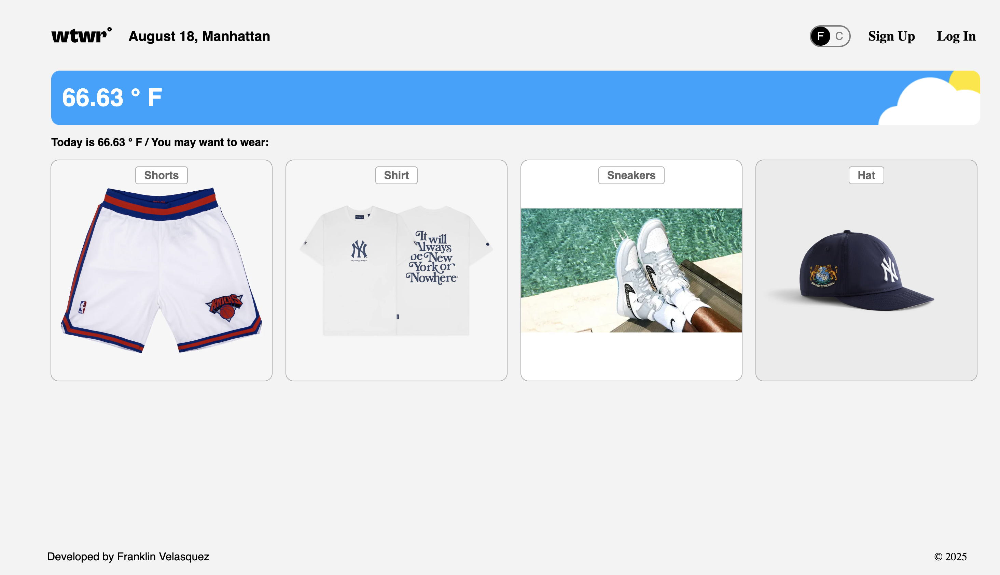
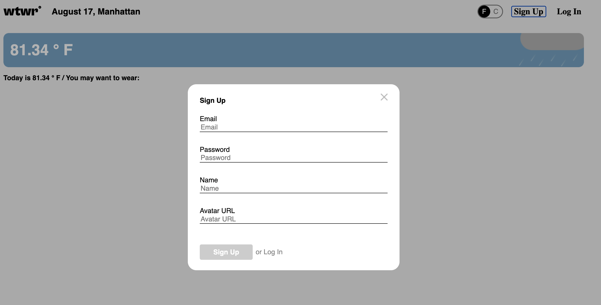
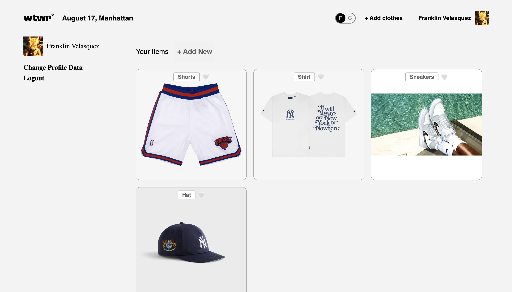
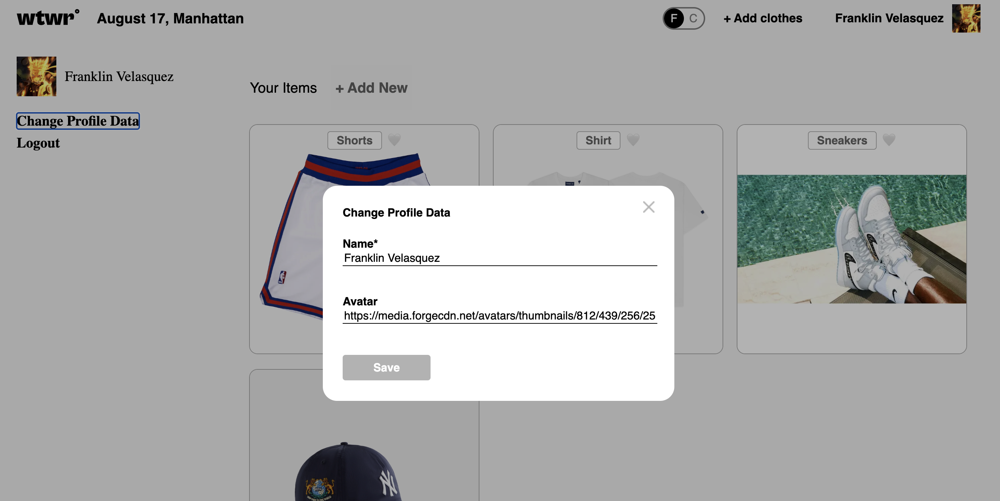
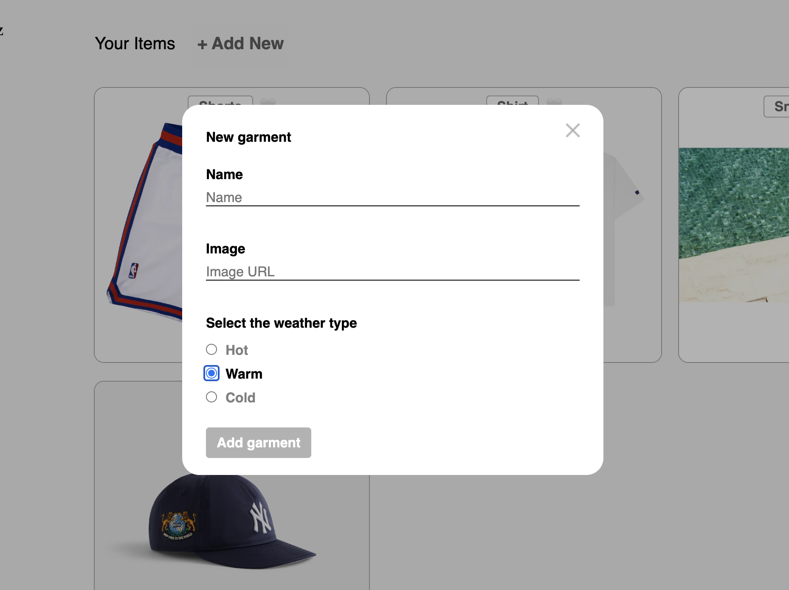
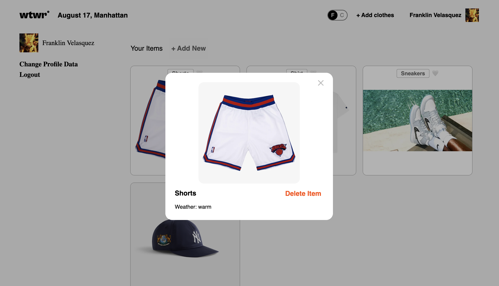
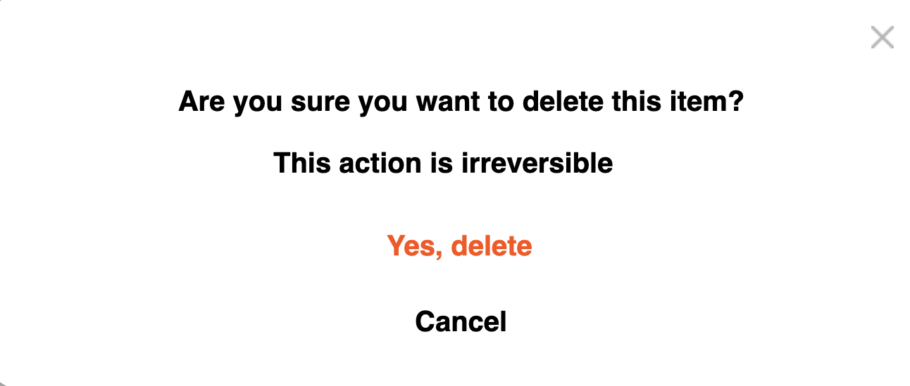

## 👔 Description - WTWR: Weather-Based Wardrobe App (React + Express)

- WWWR is a full-stack weather web app that helps users pick clothing items suited to the current weather. The app fetches weather data for a location and displays relevant garments. Users can register, log in, add, like, and delete clothing items, and manage their profiles. The app dynamically toggles temperature units between Fahrenheit and Celsius for user convenience.

## Features

- Weather Integration:

  - Fetches real-time weather data using an external API
  - Displays location-based weather information
  - Supports temperature toggling between Fahrenheit (°F) and Celsius (°C)

- Interactive Clothing Card System:

  - Displays clothing items filtered by weather type (Hot, Warm, & Cold)
  - Clickable cards show a preview of item details

- Modal System:

  - Preview modal for viewing item details
  - Add-item modal for uploading new garments
  - Authentication modals for registration and login
  - Edit profile modal for updating user info
  - Delete confirmation modal for item removal

- User Features:
  - Secure user registration & login
  - Ability to add, like, and delete clothing item cards
  - Edit user profile (name & avatar)
  - Toggle between temperature units (°F/°C)

## Technologies and Techniques Used

- FrontEnd: React (With Vite)
- Backend: Express.js (Node.js)
- Authentication: JWT-based secure login with token storage
- API Integration: OpenWeather API
- State Management: React Hooks + Context API
- Form Validation: Controlled components with inline validation
- Styling: Responsive CSS
- Developer Tools: Prettier, ESLint, Vite Dev Server

## 📡 API Overview

This project uses a Node/Express backend (`se_project_express`) which includes:

### 🔐 Auth Endpoints

- `POST /signup` — Register new user
- `POST /signin` — Log in

### 👤 User Endpoints

- `GET /users/me` — Get current user info
- `PATCH /users/me` — Update user profile

### 👚 Clothing Item Endpoints

- `GET /items` — Fetch all clothing items
- `POST /items` — Add new item
- `DELETE /items/:itemId` — Delete item by ID

### ❤️ Like Endpoints

- `PUT /items/:itemId/likes` — Like an item
- `DELETE /items/:itemId/likes` — Remove like

## Backend Repository

👉 [se_project_express](https://github.com/velasqfr/se_project_express)

## Installation and Running Locally

1. Clone the repo:
   'git clone https://github.com/velasqfr/se_project_react.git'

2. Install dependencies:
   'npm install'

3. Start the development server:
   'npm run dev' in frontend folder (uses Vite)
   'npm start' in backend folder

4. Open `http://localhost:3000` in your browser

## 📸 Screenshots

### 🏠 Homepage & User Flow

**🏠 Home Screen**  

**🔐 Register Screen**  

**🔐 Login Screen**  

**👤 User Profile Page**  

**📝 Edit Profile Modal**  

---

### 👕 Clothing Item Interactions

**➕ Add Clothing Item Modal**  

**👕 Clothing Item Preview Modal**  

**🗑️ Deletion Confirmation Modal**  

## Future Improvements:

- Filtering clothing items by tag or category
- Adding support for multiple locations

## ⚛️ React + Vite Setup

This template provides a minimal setup to get React working in Vite with HMR and some ESLint rules.

Currently, two official plugins are available:

This project uses Vite for lightning-fast builds and hot module replacement (HMR). The template includes:
@vitejs/plugin-react — uses Babel for Fast Refresh
@vitejs/plugin-react-swc — uses SWC for improved performance
